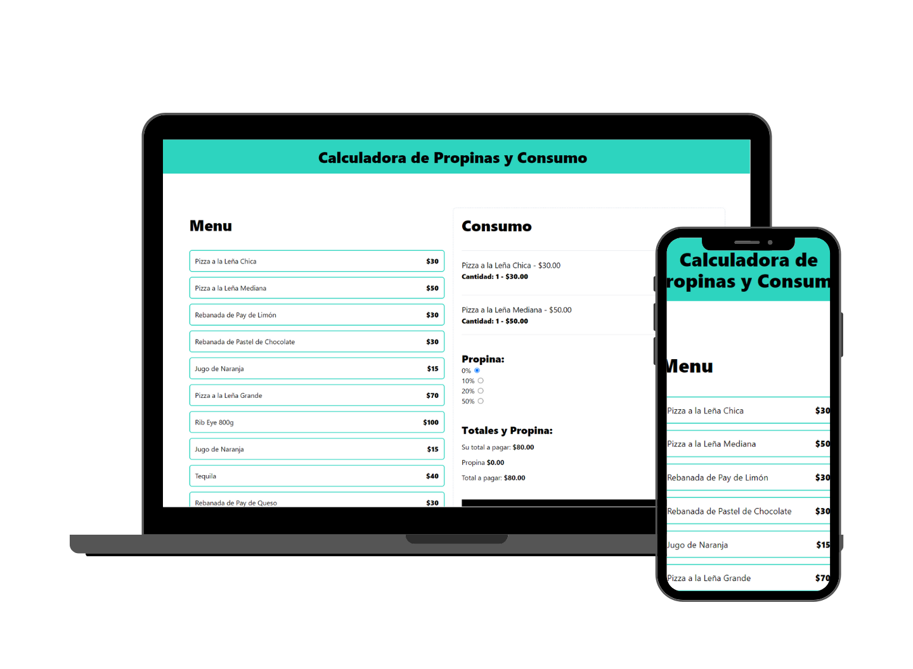

# 📱 Tip and Consumption Calculator

## 📖 Project Description
A web application that includes a menu where you can place an order and add a tip.

## 💻 Technologies Used
 

## 📚 What I Learned
I learned more about React performance using `useMemo` and `useCallback`. I also learned some ways to infer data types in TypeScript projects. Soon, I will be learning how to store project data in a database.

## 📫 Contact Information

 
 
 
 